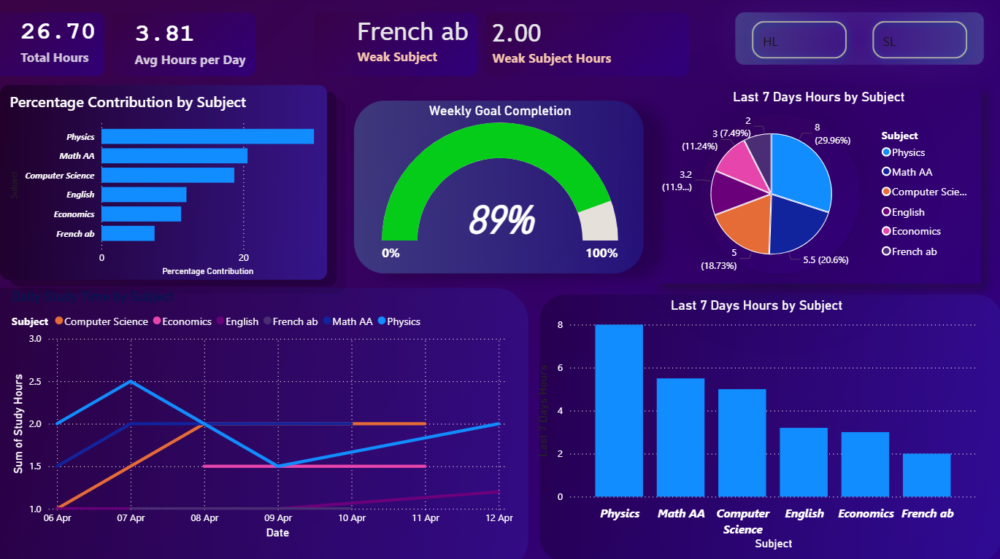
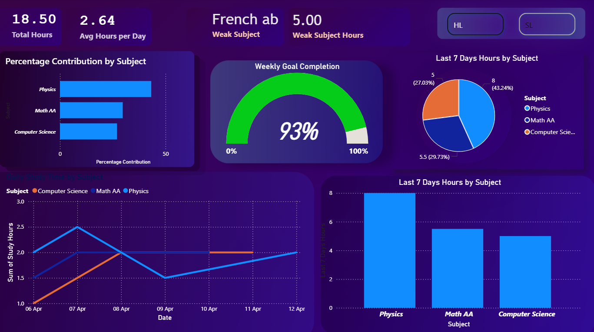
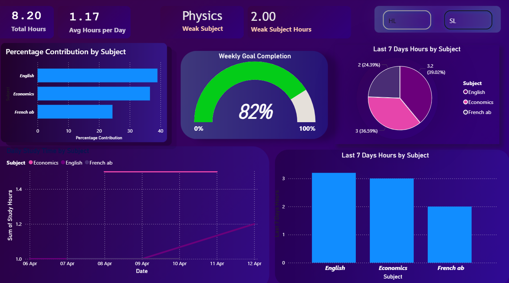

# 📊 IB Study Progress Dashboard

## 🚀 Overview

This project is a Power BI dashboard designed to track my daily study time across IB subjects (HL & SL) over the last 7 days.

## 🎯 Purpose

* Track study consistency
* Balance time between subjects
* Identify weak or ignored subjects

## 📊 Features

* Daily study time tracking
* Subject-wise time distribution
* HL vs SL filtering
* Last 7 days progress analysis

## 🛠 Tools Used

* Power BI
* Excel
* GitHub

## 📷 Dashboard Preview

### 🔹 Overview Page

### 🔹 HL Subjects

### 🔹 SL Subjects

## 📁 Files Included

* `Progress.pbix` → Power BI dashboard
* `Study_Time_Tracker_IB.xlsx` → Data file
* `Dashboard_Background.png` → Dashboard Background
## 🧠 Key Insights

* Physics study time is inconsistent
* Computer Science shows increasing focus
* SL subjects are receiving less attention

## 👨‍💻 Author

Ramandeep Singh
